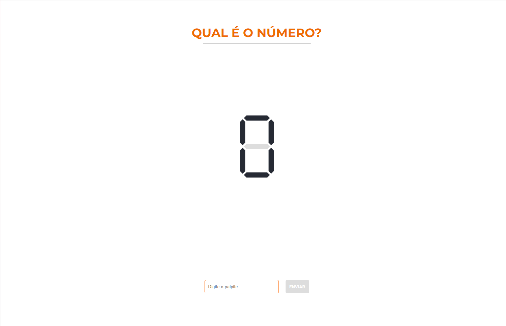
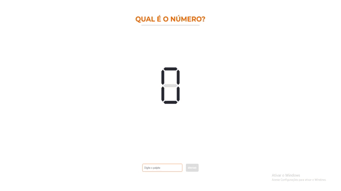
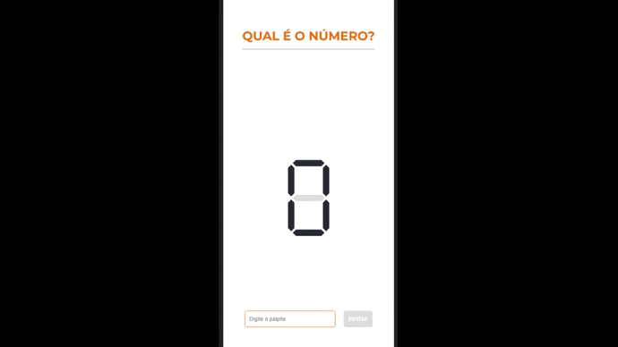

<h1 align="center">
    
</h1>

# Qual é o número?

Aplicação com intuito de trabalhar a memória e a lógica do usuário, fazendo com ele memorize os seus palpites e raciocine corretamente sua próxima tentativa. Para vencer o jogo é necessário que o usuário acerte um número entre 1 e 300 que é gerado aleatoriamente por uma API.

<h1 align="center">
    
</h1>

# O que foi utilizado:

<ul>
<li>HTML</li>
<li>CSS</li>
<li>Javascript</li>
<li>Jest</li>
</ul>

# Fui além do desafio!

💻 Realizei testes unitários na aplicação

💻 Eslint e Prettier para padronizar o código.

# Demo 📸

<div align="center" >
  
  
</div>

# Pré-requisitos

Tenha instalado em sua máquina as seguintes ferramentas: Git, Node.js e Yarn ou Npm.

# Rodando a aplicação

1.Clone o projeto

```bash
# Execute o comando através do git bash na pasta desejada
$ git clone https://github.com/Thialves02/Studio-Sol.git
```

2.Entre dentro da pasta clonada e execute o comando abaixo

```bash
# Instalar as dependências
$ yarn install
$ npm install

# Para rodar testes unitários (Opcional)
$ yarn test
$ npm test
```

3.Abra o jogo

```bash
# Abra o arquivo index.html
```
